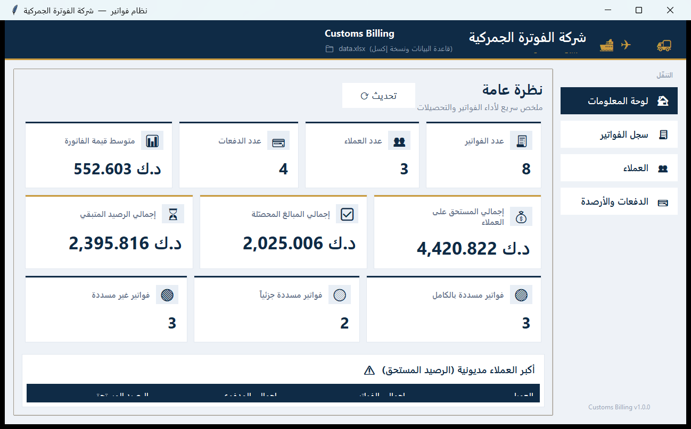
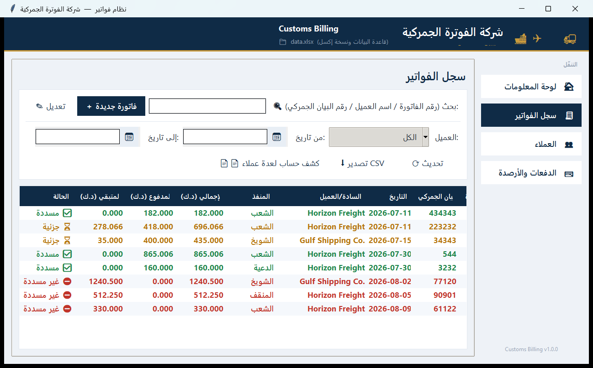
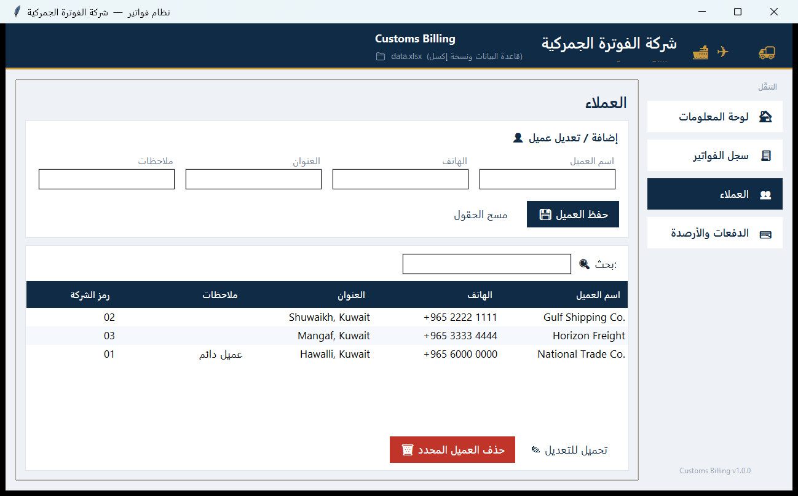
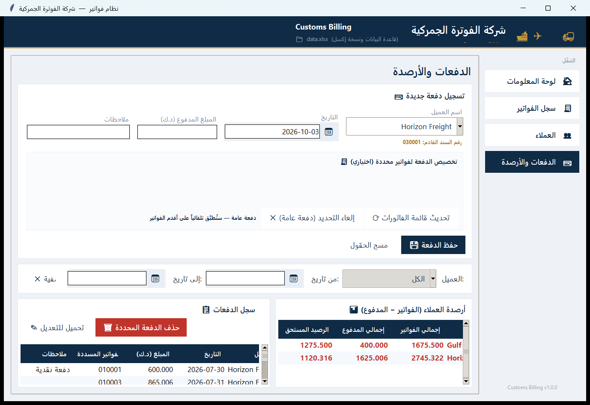
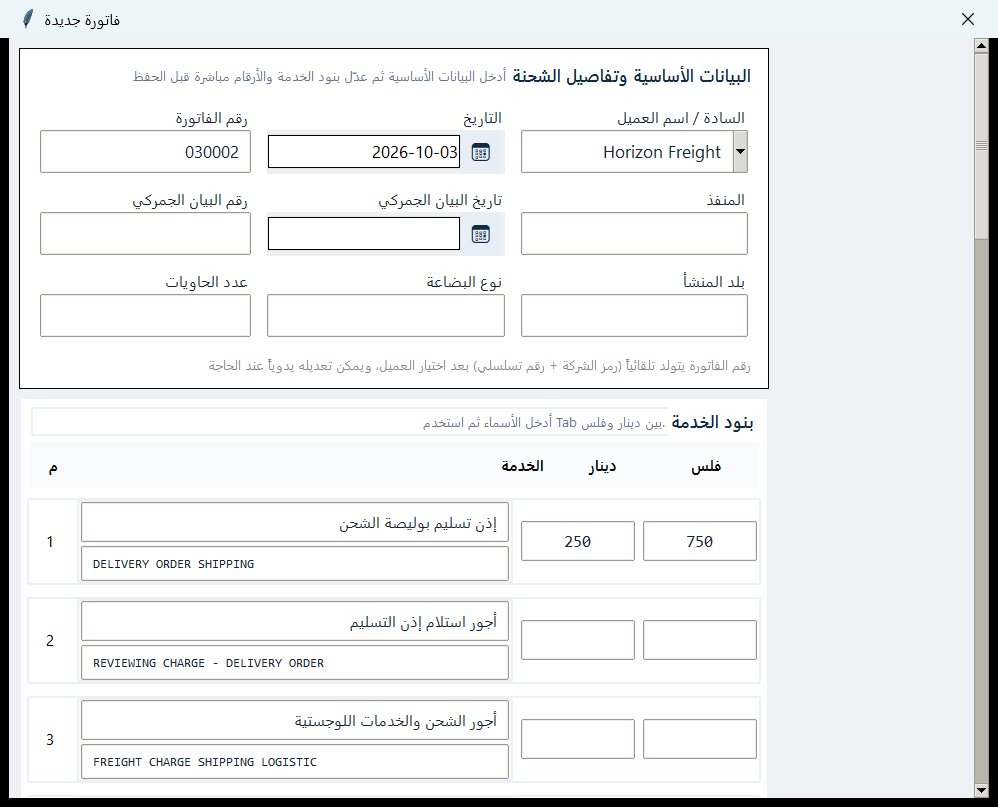

<div align="center">

# Customs Billing

**نظام الفوترة الجمركية**

Desktop invoicing & collection system for customs billing.
A standalone Windows application built with Python + Tkinter, backed by SQLite
with an Excel mirror.



</div>

---

## Features

| Area | What it does |
|---|---|
| **Invoices** | 24 customs service lines (Arabic + English), automatic totals in dinar/fils, per-invoice custom line labels |
| **Customers** | Customer records with a company code (`01`-`99`) that drives invoice and receipt numbering |
| **Payments** | Receipt vouchers, allocated to specific invoices or applied automatically to the oldest unpaid ones (FIFO) |
| **Statements** | Per-customer account statements, printable for one or many customers at once |
| **Dashboard** | KPIs, invoice status breakdown, and the top debtors |
| **Export** | CSV export, and printable HTML that matches the paper invoice layout |

### Auto numbering

Invoice and receipt numbers are generated as **company code + 4-digit sequence**:

```
company code 25 -> 250001, 250002, 250003 ...
```

### Payment allocation

* If you allocate a receipt to **specific invoices**, the amount is applied to them in the order you selected.
* Any leftover becomes a **general balance** for that customer.
* A **general balance** is applied automatically to the customer's oldest unpaid invoices first (FIFO).


## Screenshots

**Dashboard**


**Invoice register**


**Customers**


**Payments & balances**


**New invoice form**


## Storage: database + Excel mirror

| File | Role |
|---|---|
| `customs_billing.db` | **Source of truth** (SQLite). Created automatically on first run. |
| `data.xlsx` | **Excel mirror**, refreshed after every change so it stays openable in Excel. |

On first run, if the database is empty and an existing `data.xlsx` contains data,
its contents are imported **once, automatically** - existing data is never lost.
After that the database is authoritative and the Excel copy is kept in sync.

> If `data.xlsx` is open in Excel while you save, your data is still written to
> the database safely; only the Excel mirror is deferred.


## Requirements

* Python 3.9 or newer
* Windows / macOS / Linux (on Linux you may need `sudo apt install python3-tk`)

## Installation

```bash
pip install -r requirements.txt
```

## Running

```bash
python main.py
```

The interface works fully without `ttkbootstrap` (it falls back to the built-in
Tkinter look); install it for the flatter, modern theme.

### First run

1. Run `python main.py` - `customs_billing.db` and `data.xlsx` are created automatically.

No logo file is required. The header and the printed letterhead fall back to a
text-only design, and the window keeps the default Tkinter icon. To use your own
branding, drop `logo.png` (full logo for the header) and `icon.png` (window and
letterhead artwork) next to `main.py` - both are picked up automatically when
present and bundled into the executable by `build_exe.bat`.

## Building the executable

```bat
build_exe.bat
```

or directly:

```bash
python -m PyInstaller --noconfirm --clean customs-billing.spec
```

Output: `dist/customs-billing.exe` - a standalone binary that runs on
any Windows machine without installing Python.


## Project structure

```
.
|-- main.py                          entry point
|-- requirements.txt
|-- build_exe.bat                    executable build script
|-- customs-billing.spec             PyInstaller configuration
|-- icon.png / logo.png              optional artwork (auto-detected)
|-- customs_billing/                 main package
|   |-- config.py                    paths + company identity (single source)
|   |-- constants.py                 service lines, invoice fields, headers
|   |-- utils.py                     number-to-words, safe conversions
|   |-- data/                        data layer
|   |   |-- db.py                    SQLite connection & schema
|   |   |-- repository.py            CRUD operations
|   |   |-- excel_mirror.py          Excel mirror + legacy import
|   |   |-- numbering.py             auto invoice/receipt numbering
|   |   `-- analytics.py             balances, payment status, KPIs
|   `-- ui/                          Tkinter interface
|       |-- app.py                   main window & navigation
|       |-- tab_dashboard.py         dashboard tab
|       |-- tab_invoices.py          invoice register tab
|       |-- tab_customers.py         customers tab
|       |-- tab_payments.py          payments & balances tab
|       |-- invoice_form.py          new / edit invoice dialog
|       |-- printing.py              printable HTML generation
|       |-- theme.py                 colour palette
|       `-- widgets.py               shared widgets (date picker)
|-- screenshots/                     README images
`-- tests/                           test suite
```

## Tests

```bash
python -m pytest tests -q                  # data layer + UI flows
python tests/smoke_ui.py                   # build the window, verify every tab
python tests/capture_screenshots.py        # regenerate screenshots/
```

The suite covers the data layer (CRUD, Excel import, numbering, allocation
logic) **and** UI flows that drive the real window: creating an invoice,
recording a payment, allocating it, printing, CSV export, search and filtering.

## Customising the company name

Company details live in one place - `customs_billing/config.py`:

```python
APP_NAME        = "Customs Billing"
COMPANY_NAME_AR = "شركة الفوترة الجمركية"
COMPANY_NAME_EN = "Customs Billing"
```

Changing these updates the window header, the printed invoice letterhead, and
the customer statement.

## Notes

* SQLite runs in **WAL** mode with `synchronous=FULL`, so data survives a power
  cut or an unexpected shutdown.
* The order in which a receipt is allocated to invoices is stored, because the
  distribution calculation depends on it.
* Custom service-line labels are stored in the database and written into the
  Excel mirror's notes column in a tagged format, for compatibility with files
  produced by earlier versions.
* Importing `customs_billing.data` does **not** load Tkinter, so the
  data layer can be scripted or tested headlessly.

## License

Provided as-is for internal business use.
