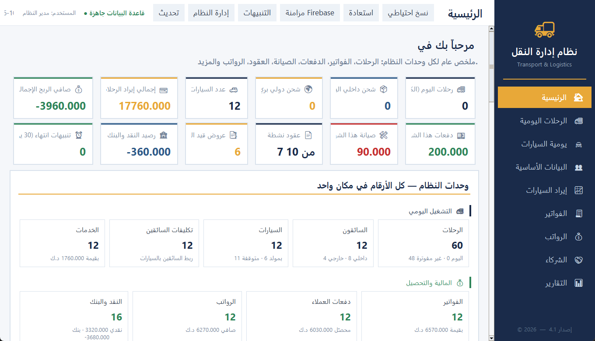
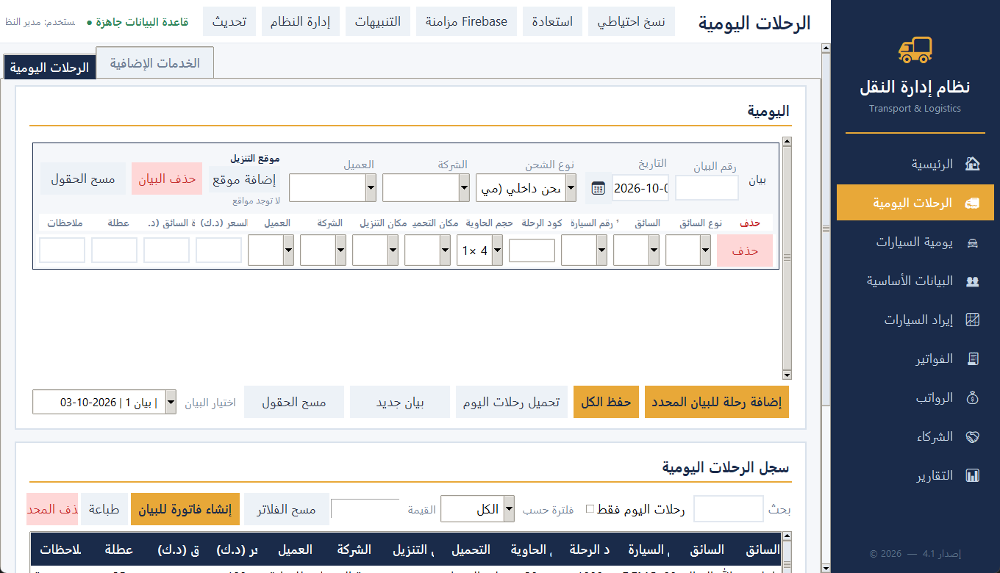
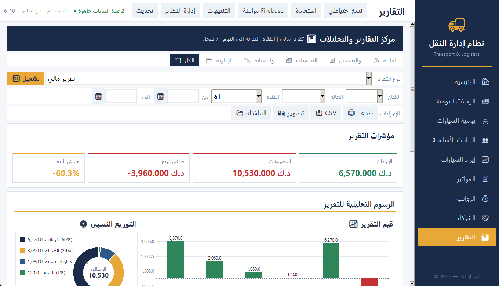
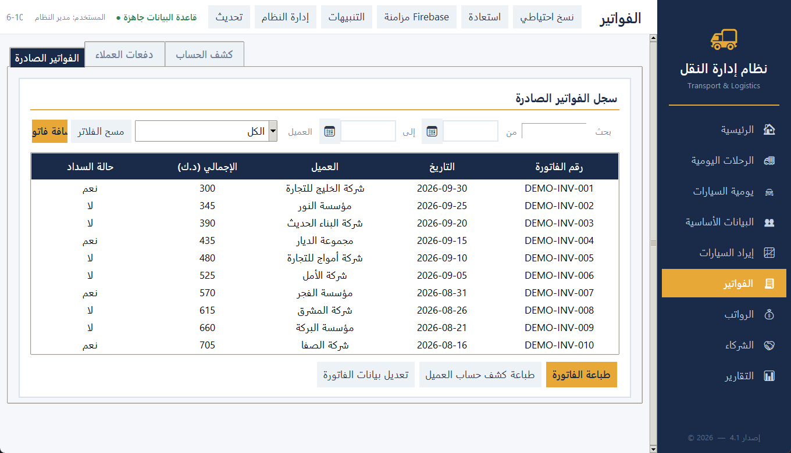
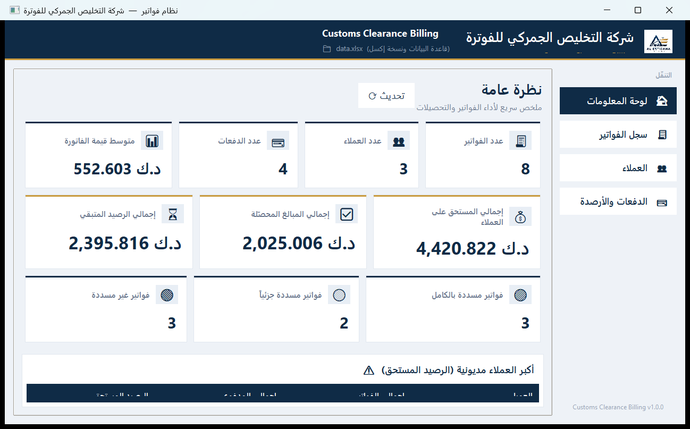
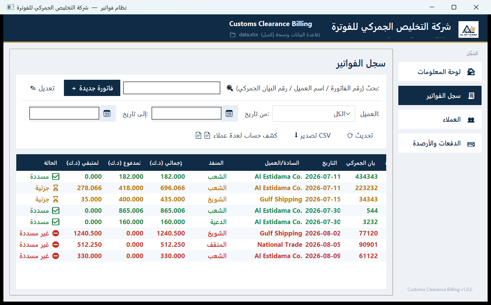

# Enterprise Automation Systems

A repository containing two independent projects:

| Folder | Project | Description |
|---|---|---|
| [`TransportSystem/`](TransportSystem/) | Transport Management System | Desktop app for trips, drivers, invoices, salaries and financial reports |
| [`customs-clearance-billing/`](customs-clearance-billing/) | Customs Clearance Billing | Invoice & collection system for customs clearance, SQLite with an Excel mirror |

Each project is fully self-contained: it has its own entry point, requirements
and documentation.

---

## Transport Management System

```bash
cd TransportSystem
pip install -r requirements.txt
python main.py
```

Full documentation: [`TransportSystem/README.md`](TransportSystem/README.md).

The project is organised as a `transport/` package rather than one large file:

- `transport/app_*.py` — application layers (screen mixins)
- `transport/ui_*.py` — shared widgets and data-entry screens
- `transport/print_*.py` — printing, invoices and letterhead
- `transport/data/*.py` — database layer

### Screens

| Home | Daily trips |
|---|---|
|  |  |

| Reports | Invoices |
|---|---|
|  |  |

All nine screens are in [`TransportSystem/README.md`](TransportSystem/README.md#screenshots).

**The source contains no private data.** Every user supplies their own company
details and Firebase project. See [FIREBASE_SETUP.md](TransportSystem/FIREBASE_SETUP.md).

To build a standalone executable, run `TransportSystem\build_exe.bat`, which
produces `TransportApp.exe`.

---

## Customs Clearance Billing

Invoice and collection system for customs-clearance billing, with an Arabic
interface. SQLite is the source of truth and `data.xlsx` is kept as a
synchronised Excel mirror. Invoice and receipt numbers are generated
automatically from the customer's company code, and receipts can be allocated
to specific invoices or applied to the oldest unpaid ones (FIFO).

```bash
cd customs-clearance-billing
pip install -r requirements.txt
python main.py
```

Full documentation: [`customs-clearance-billing/README.md`](customs-clearance-billing/README.md).

### Screens

| Dashboard | Invoice register |
|---|---|
|  |  |

| Customers | Payments & balances |
|---|---|
|  |  |

| New invoice form |
|---|
|  |

**The source contains no business data.** The SQLite database and `data.xlsx`
are created on first run and are excluded by [.gitignore](.gitignore). Company
details are set in `customs_clearance_billing/config.py`.

The test suite covers the data layer and real UI flows:

```bash
cd customs-clearance-billing
python -m pytest tests -q
```

To build a standalone executable, run `customs-clearance-billing\build_exe.bat`,
which produces `customs-clearance-billing.exe`.

---

## Notes

- [.gitignore](.gitignore) excludes databases, Excel exports, attachments and
  any file holding business data or secrets.
- [.gitattributes](.gitattributes) normalises line endings across platforms.