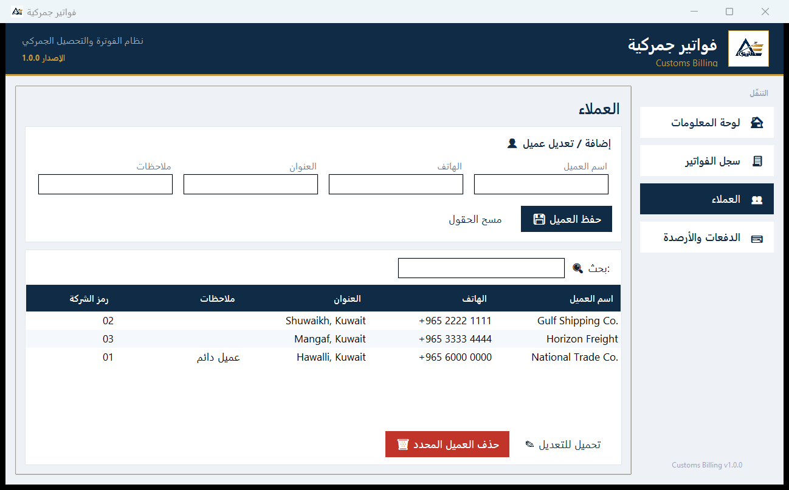
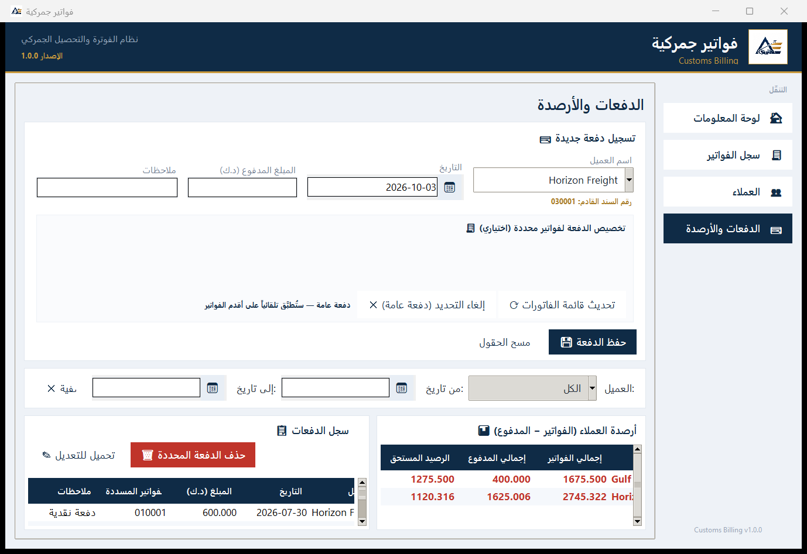
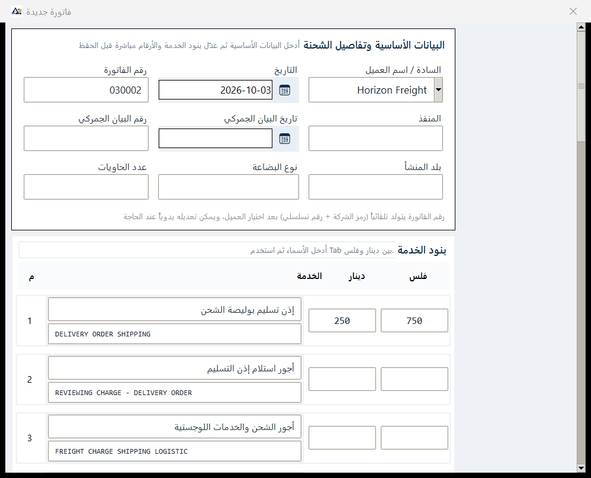

# Enterprise Automation Systems

A repository containing three independent projects:

| Folder | Project | Description |
|---|---|---|
| [`TransportSystem/`](TransportSystem/) | Transport Management System | Desktop app for trips, drivers, invoices, salaries and financial reports |
| [`customs-billing/`](customs-billing/) | Customs Billing | Invoice & collection system for customs billing, SQLite with an Excel mirror |
| [`catering-management-system/`](catering-management-system/) | Catering Management System | Arabic (RTL) desktop app for catering businesses: institutional orders, events, invoicing, payroll and reports |

Each project is fully self-contained: it has its own entry point, requirements
and documentation.

---

## Transport Management System

```bash
cd TransportSystem
pip install -r requirements.txt
python main.py
```

Full documentation: [`TransportSystem/README.md`](TransportSystem/README.md).

The project is organised as a `transport/` package rather than one large file:

- `transport/app_*.py` — application layers (screen mixins)
- `transport/ui_*.py` — shared widgets and data-entry screens
- `transport/print_*.py` — printing, invoices and letterhead
- `transport/data/*.py` — database layer

### Screens

| Home | Daily trips |
|---|---|
|  |  |

| Reports | Invoices |
|---|---|
|  |  |

All nine screens are in [`TransportSystem/README.md`](TransportSystem/README.md#screenshots).

**The source contains no private data.** Every user supplies their own company
details and Firebase project. See [FIREBASE_SETUP.md](TransportSystem/FIREBASE_SETUP.md).

To build a standalone executable, run `TransportSystem\build_exe.bat`, which
produces `TransportApp.exe`.

---

## Customs Billing

Invoice and collection system for customs billing, with an Arabic
interface. SQLite is the source of truth and `data.xlsx` is kept as a
synchronised Excel mirror. Invoice and receipt numbers are generated
automatically from the customer's company code, and receipts can be allocated
to specific invoices or applied to the oldest unpaid ones (FIFO).

```bash
cd customs-billing
pip install -r requirements.txt
python main.py
```

Full documentation: [`customs-billing/README.md`](customs-billing/README.md).

### Screens

| Dashboard | Invoice register |
|---|---|
|  |  |

| Customers | Payments & balances |
|---|---|
|  |  |

| New invoice form |
|---|
|  |

**The source contains no business data.** The SQLite database and `data.xlsx`
are created on first run and are excluded by [.gitignore](.gitignore). Company
details are set in `customs_billing/config.py`.

The test suite covers the data layer and real UI flows:

```bash
cd customs-billing
python -m pytest tests -q
```

To build a standalone executable, run `customs-billing\build_exe.bat`,
which produces `customs-billing.exe`.

---

## Catering Management System

Desktop system for a catering business with a full Arabic right-to-left
interface — sidebar, tables, fields, buttons and tabs all mirror correctly.

> [!WARNING]
> **Work in progress (v2.3.0).** This project is still under active
> development: the core workflows work, but some areas are incomplete.
> See the status table in the project README. Covers institutional meal contracts, events and
weddings, invoicing with partial payments and customer statements, purchases,
expenses, payroll and financial reports.

SQLite is the default store; Excel is kept as an import/export format and is
migrated automatically on first launch.

| Invoices & statements | Reports & charts |
|---|---|
|  |  |

| Home | Orders & events |
|---|---|
|  |  |

All seven screens are in
[`catering-management-system/README.md`](catering-management-system/README.md#screens).

```bash
cd catering-management-system
pip install -r requirements.txt
python restaurant_desktop_app.py
```

Full documentation: [`catering-management-system/README.md`](catering-management-system/README.md).

The project is organised into focused modules rather than one large file:

- `restaurant_data.py` — thin public data API (a facade over `core/data`)
- `core/data/` — `config` (schema), `validation`, `runtime` (mutable state),
  `sqlite`, `storage` (generic CRUD, atomic saves, backups, audit log)
- `core/data/repos/` — business rules, one module per domain
- `core/` — money (Decimal), analytics, Arabic PDF output
- `ui/` — theme, navigation, shared tabs and one mixin per screen group
- `tests/` — six suites covering the data layer, safety, both backends and the UI

**The source contains no business data.** The database, Excel workbooks,
backups and logs are created on first run and excluded by
[.gitignore](.gitignore). Company details are set in
`catering-management-system/core/data/config.py`.

The test suite runs against temporary files and never touches real data:

```bash
cd catering-management-system
python -m pytest
```

CI (lint plus the suite on Linux and Windows) is defined in
[`.github/workflows/catering-system.yml`](.github/workflows/catering-system.yml).

To build a standalone executable, run
`catering-management-system\build_exe.bat`, which produces
`CateringManager.exe`.

---

## Notes

- [.gitignore](.gitignore) excludes databases, Excel exports, attachments and
  any file holding business data or secrets.
- [.gitattributes](.gitattributes) normalises line endings across platforms.