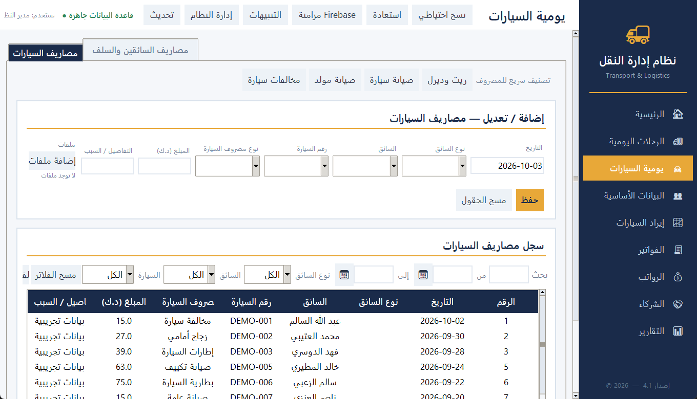
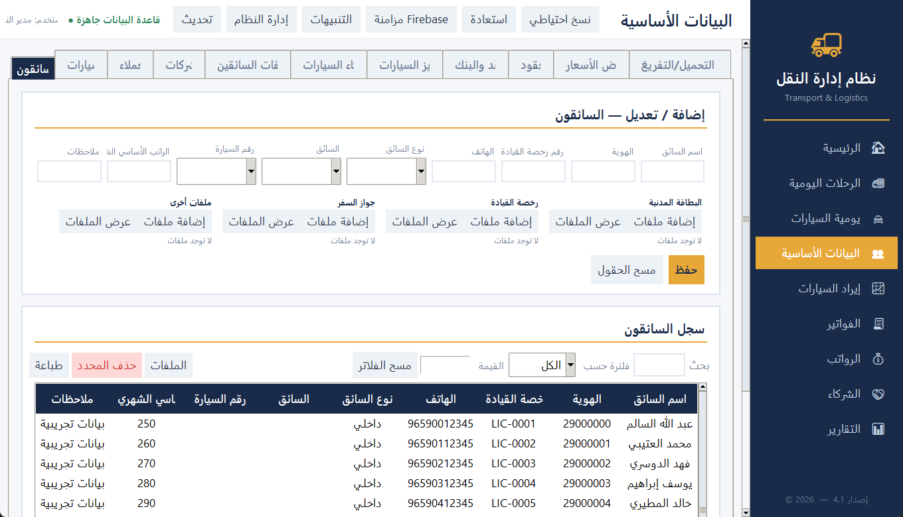
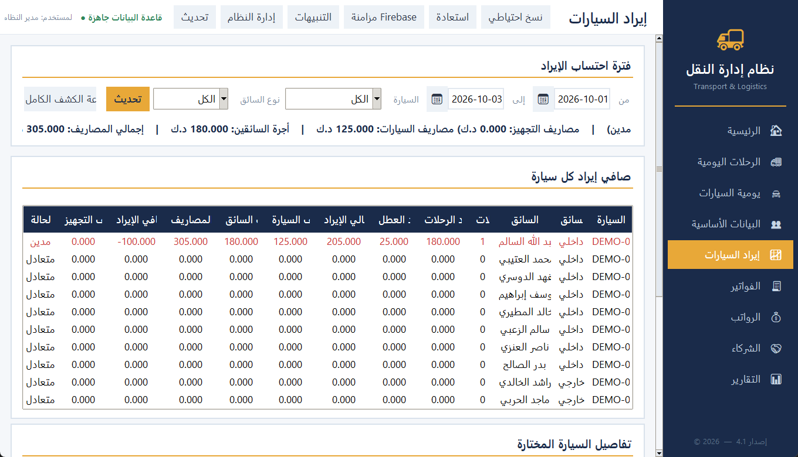
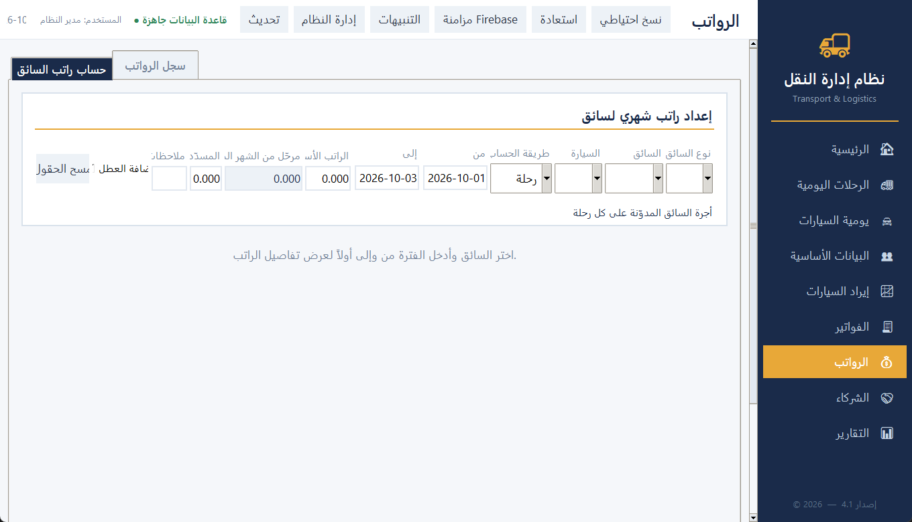
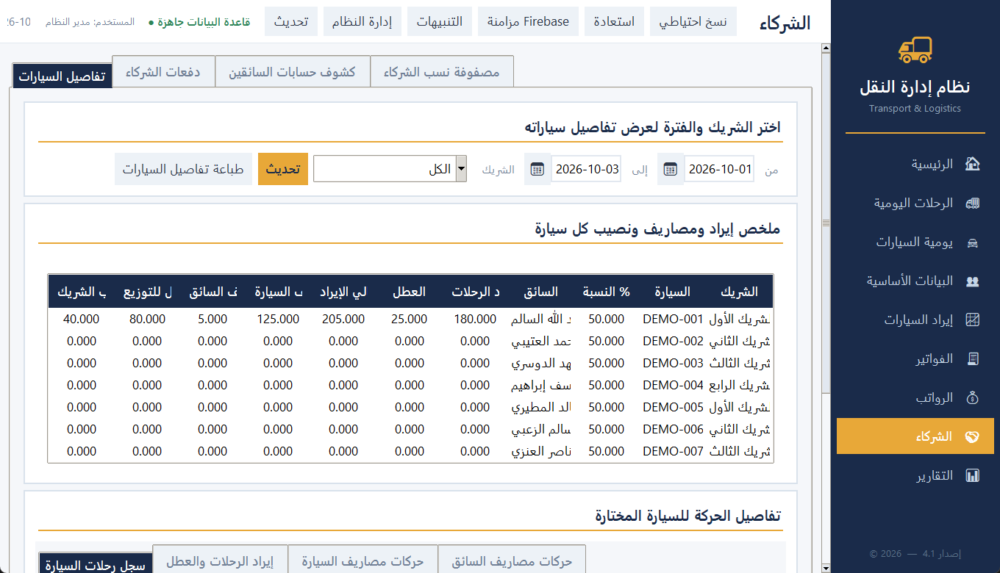

# Transport Management System

A Windows desktop application for running a transport company: daily trips,
drivers and vehicles, invoices and payments, salaries, partners, and financial
reports.

Built with Tkinter, storing data locally in SQLite, with optional cloud sync to
Firebase or Google Sheets.

---

## Screenshots

All nine screens, captured from the running application with demo data.

### Home — dashboard


### Daily trips


### Daily cars



### Master data



### Vehicle revenue



### Invoices


### Salaries



### Partners and driver accounts



### Reports


> The screenshots show the interface in Arabic, which is the application's
> working language.

To regenerate them after changing the UI:

```bash
python _capture_screenshots.py
```

This seeds demo data into a throwaway database, walks each tab and writes the
images to `docs/screenshots/`. Your real database is never touched.

---

## Quick start

```bat
:: installs dependencies if needed, then runs
run_app.bat
```

Or run it directly with Python:

```bash
pip install -r requirements.txt
python main.py
```

## Build the executable

```bat
build_exe.bat
```

Produces `dist\TransportApp.exe` — a single file that runs on any Windows
machine without installing Python.

---

## Project structure

The project is split into a `transport/` package instead of one very large
file, so each concern lives in its own module.

### Application layer (`transport/app_*.py`)

| File | Responsibility | Lines |
|---|---|---|
| `app.py` | Composes the layers into the `TransportApp` class | 19 |
| `launcher.py` | Startup and single-instance enforcement | 27 |
| `app_core.py` | Setup, cloud sync, navigation, home screen | 1642 |
| `app_entities.py` | Master-data tabs, invoices, payments | 1520 |
| `app_salaries.py` | Salary tab and the salary calculator | 1824 |
| `app_partners.py` | Partners and driver accounts | 1145 |
| `app_reports.py` | Reports tab and every report it produces | 2219 |

`TransportApp` was originally a single class with **218 methods in 8,763
lines**. It is now five mixin modules assembled by `app.py`, so editing a report
no longer pulls in the salary screen.

### UI layer

| File | Responsibility |
|---|---|
| `app_config.py` | Colours, fonts, paths, report categories |
| `ui_helpers.py` | Small shared helpers and the error log |
| `ui_widgets.py` | Cards, entries, buttons, scrolling |
| `ui_text_edit.py` | Copy/cut/paste inside entry fields |
| `ui_dialogs.py` | Date picker and attachment manager |
| `ui_crud_tab.py` | Reusable CRUD frame (form + table + search) |
| `ui_pages_*.py` | Trips, expenses and revenue screens |
| `ui_sidebar.py` / `ui_login.py` | Navigation bar and sign-in window |

### Print layer (`transport/print_*.py`)

`print_theme.py` (shared print identity and A4 layout) ·
`print_letterhead.py` (company letterhead) · `print_invoice.py` (invoices) ·
`print_statement.py` (customer statements).

### Data layer (`transport/data/`)

| File | Responsibility |
|---|---|
| `paths.py` | Application paths and company details |
| `schema.py` | Column definitions and option lists |
| `core.py` | Database connection, caching, row operations |
| `users.py` / `audit.py` | Users, permissions, audit log |
| `entities.py` | Drivers, vehicles, customers, places |
| `trips.py` | Trips, services, daily expenses |
| `finance.py` | Invoices, payments, maintenance, fuel |
| `reports.py` | Financial calculations, reports, salary maths |
| `attachments.py` | Attachments and loading/unloading locations |
| `backup.py` / `sync.py` | Backups and cloud synchronisation |

`transport/data/__init__.py` re-exports every name, so the rest of the code
still writes `from . import data as td` exactly as before — no change to any
business logic.

---

## Commands

| Command | Purpose |
|---|---|
| `python main.py` | Run the application |
| `python -m transport` | Same as above |
| `python _smoke_test.py` | Full test: opens the window and visits every screen |
| `python _verify_split.py` | Confirms every method survived the module split |
| `python _capture_screenshots.py` | Regenerates the screenshots in `docs/screenshots/` |
| `build_exe.bat` | Build `TransportApp.exe` |

---

## Per-machine setup

The source contains no private data: no company name, address, phone number,
email address, or Firebase project ID. Each user supplies their own.

Copy `.env.example` to `.env` and fill in what you need:

```
TRANSPORT_COMPANY_NAME_AR / _EN      Company name (invoice letterhead)
TRANSPORT_COMPANY_ADDRESS_AR / _EN   Address
TRANSPORT_COMPANY_PHONE / _EMAIL     Phone and email
FIREBASE_API_KEY / _DATABASE_URL …   Cloud sync settings
```

Without these values the application runs normally, but printed documents have
no company letterhead.

## Firebase cloud sync (optional)

**Sync works, and it needs your own Firebase project.** No project is baked
into the source.

On first launch a **"Firebase sync setup"** window asks for:

- Realtime Database URL
- Web API Key
- Email address
- Password

These are saved to `firebase_sync_config.json` **next to the program on your
own machine** (gitignored) and reused on every subsequent run. To remove them:
delete that file and restart.

Full steps for creating a project are in [FIREBASE_SETUP.md](FIREBASE_SETUP.md).

## Files not committed to Git

| File | Reason |
|---|---|
| `transport_data.db` · `*.xlsx` | Actual company records |
| `backups/` · `attachments/` · `report_screenshots/` | Local backups and files |
| `firebase_sync_config.json` | **The user's own Firebase credentials** |
| `.env` | Same purpose, expressed as environment variables |
| `.firebaserc` | The user's Firebase project ID |
| `build/` · `dist/` | Build output |