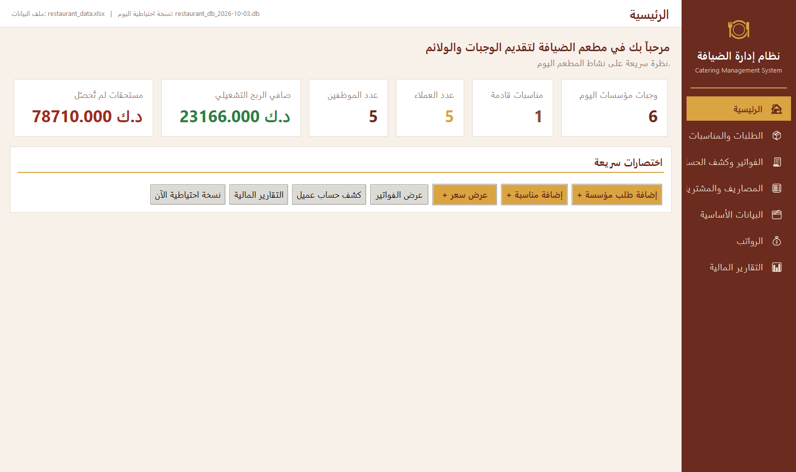
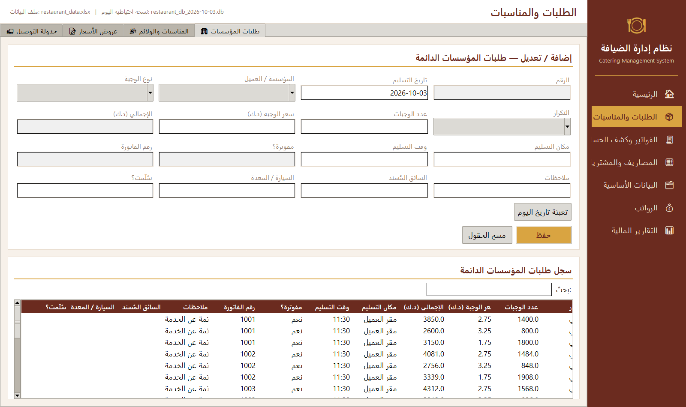
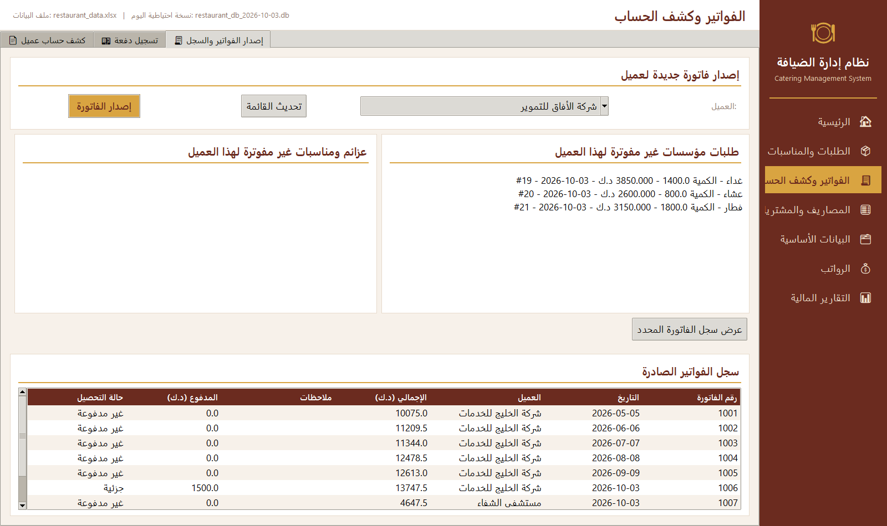
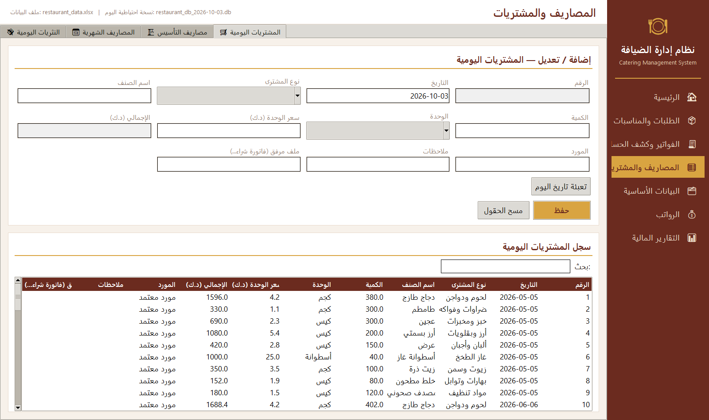
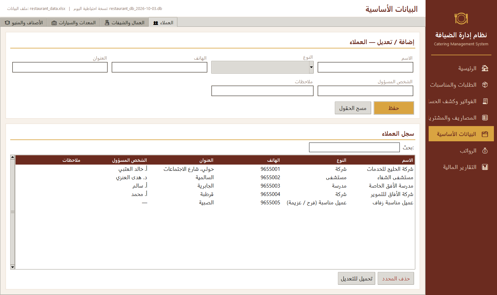
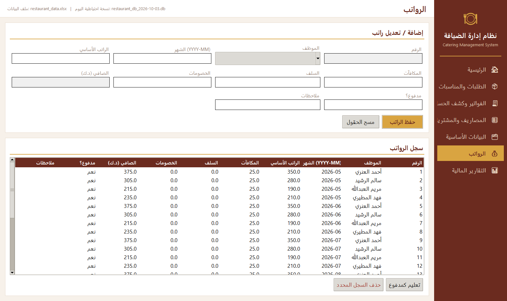
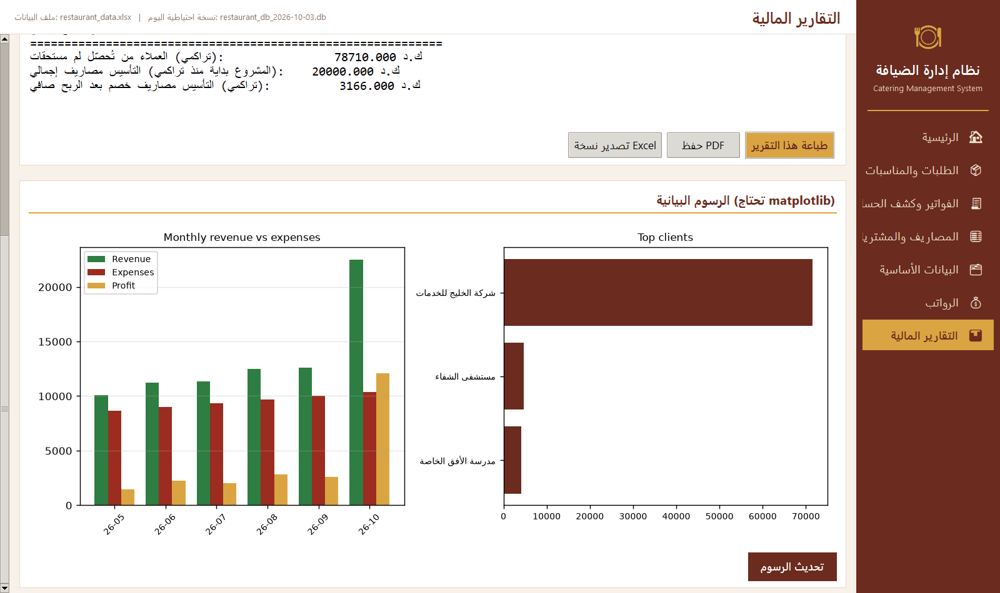

# Catering Management System

نظام إدارة الضيافة — تطبيق سطح مكتب بواجهة عربية (RTL) لإدارة مؤسسات الضيافة:
طلبات المؤسسات الدائمة، المناسبات والولائم، الفواتير والتحصيل، المشتريات
والمصاريف، الرواتب، والتقارير المالية.

Catering management desktop application: institutional meal contracts, events &
weddings, invoicing and receivables, purchases, expenses, payroll, and financial
reports — with a full Arabic right-to-left interface.

**Version:** 2.3.0 · **Language:** Python 3.11+ · **UI:** Tkinter (full RTL) · **Storage:** SQLite (Excel import/export)



---

## Arabic right-to-left support

The whole interface is built for Arabic, right to left:

| Element | Behaviour |
|---|---|
| **Navigation** | The sidebar sits on the **right**; its items read top-down in Arabic |
| **Tables** | Column order is mirrored — the first column appears **rightmost** — and every heading and cell is right-aligned |
| **Fields** | Every entry, combo box and date field takes input from the **right**, with the caret at the right edge |
| **Buttons** | Action bars fill from the right, so the primary action is the right-most button |
| **Tabs** | Sub-tabs run right to left; the first tab is the right-most and the default |
| **Scrollbars** | Vertical scrollbars sit on the **left**, as Arabic users expect |
| **Text panels** | Report output and the printable invoice/statement are `dir="rtl"` |
| **PDF** | Arabic is reshaped and reordered with `arabic-reshaper` + `python-bidi` |

Tkinter has no native RTL mode, so these rules are centralised in
[`ui/rtl.py`](ui/rtl.py) and applied in one pass after the screens are built —
new widgets inherit the correct direction automatically instead of each screen
repeating the rules.

---

## Screens

| Home | Orders & events |
|---|---|
|  |  |

| Invoices & statements | Expenses & purchases |
|---|---|
|  |  |

| Master data | Payroll |
|---|---|
|  |  |

| Financial reports & charts |
|---|
|  |

Regenerate them any time with `python capture_screenshots.py` — it builds a
throwaway database with demo data and captures each screen, so your real data is
never touched.

---

## Features

| Area | What it does |
|---|---|
| **Orders & events** | Institutional orders (daily/weekly), events and weddings, quotations that convert to real events, delivery scheduling with driver/vehicle assignment |
| **Invoicing** | Invoice generation from unbilled orders and events, partial payments, payment methods, invoice status, **customer statements** |
| **Expenses** | Setup (capital) expenses, monthly fixed expenses, daily purchases, daily petty cash |
| **Payroll** | Monthly salaries per employee with upsert (no double counting), bonuses, advances, deductions |
| **Master data** | Customers, staff & chefs, equipment & delivery vehicles, products and menu catalogue |
| **Reporting** | Operating P&L, receivables, monthly revenue/expense/profit charts, Arabic PDF invoices & statements |
| **Data safety** | Atomic saves, daily backups, audit log, single-instance lock, automatic Excel→SQLite migration |

---

## Quick start

```bash
pip install -r requirements.txt
python restaurant_desktop_app.py
```

On first launch the app creates `restaurant.db` next to itself. If an old
`restaurant_data.xlsx` is found beside it, its data is imported automatically
(with a dated backup) — no manual migration step.

### Optional features

```bash
pip install -e .[charts]   # matplotlib charts in the Reports screen
pip install -e .[pdf]      # Arabic PDF invoices & statements
```

### Build a standalone executable

```bash
build_exe.bat        # Windows, requires pyinstaller
```

---
## Project layout

The codebase is split into focused modules — no single file holds unrelated
concerns. `restaurant_data.py` is a thin **facade** that re-exports the data
API, so the UI and tests are unaffected by how the data layer is organised.

```
restaurant_desktop_app.py     Application shell: window, navigation, main()
restaurant_data.py            Public data API (facade over core/data)
migrate_to_sqlite.py          One-time Excel -> SQLite migration tool

core/
  money.py                    Decimal arithmetic for all money
  analytics.py                Monthly series, top clients, receivables
  pdf_ar.py                   Arabic PDF invoices / statements / reports
  version.py                  Single source of the version number
  data/                       -- the data layer --
    config.py                 Schema: tables, columns, company details
    validation.py             Safe parsing (dates, numbers, invoice JSON)
    runtime.py                Mutable state: backend, paths, instance lock
    sqlite.py                 SQLite engine (WAL, migrations, Excel I/O)
    storage.py                Generic CRUD + atomic saves, backups, audit
    repos/                    Business rules, one module per domain
      masterdata.py           Staff, equipment, customers, products
      expenses.py             Setup/monthly expenses, purchases, petty cash
      orders.py               Institutional orders, events, quotations, delivery
      invoices.py             Invoices, payments, customer statements
      salaries.py             Monthly payroll
      reporting.py            Financial summaries

ui/
  theme.py                    Colours, fonts, shared widgets, scroll area
  nav.py                      Sidebar and page registry
  rtl.py                      Right-to-left rules for fields, tables and tabs
  tabs.py                     Reusable CRUD / dated-order tab screens
  dialogs.py                  Single messagebox seam for the whole UI
  printing.py                 HTML print output for invoices and reports
  record_window.py            Printable record window
  file_picker.py              Attachment picking and viewing
  pages/                      One mixin per screen group
    home.py  orders.py  expenses.py  masterdata.py
    invoices.py  salaries.py  reports.py  charts.py

tests/                        Six suites + a pytest bridge (see below)
```

### Architecture rules

- **One owner per piece of state.** `core/data/runtime.py` is the only module
  that owns mutable state (backend, file paths, instance lock). Everything else
  reads it, so there is no second copy to fall out of sync.
- **Schema in one place.** Adding a table column means editing only
  `core/data/config.py`. New columns are always appended last so old Excel
  files keep their column positions.
- **Backends stay swappable.** `storage.py` dispatches every operation to
  either SQLite or Excel, so business rules never know which engine is active.
- **Money is never a float.** All arithmetic goes through `core/money.py`
  (`Decimal`), and floats appear only at the UI boundary.

---

## Data and storage

| | |
|---|---|
| **Default engine** | SQLite (`restaurant.db`), WAL mode, auto column migration |
| **Legacy engine** | Excel, via `RESTAURANT_BACKEND=excel` |
| **Exchange format** | Excel - import/export only |

| Environment variable | Purpose | Default |
|---|---|---|
| `RESTAURANT_BACKEND` | `sqlite` or `excel` | `sqlite` |
| `RESTAURANT_DB_FILE` | SQLite database path | `restaurant.db` beside the app |
| `RESTAURANT_DATA_FILE` | Excel workbook path | `restaurant_data.xlsx` beside the app |

Company name, address, phone, and email are configured in
`core/data/config.py` and printed on every invoice.

### Data safety

- **Atomic saves** - the workbook is written to a temp file then replaced.
- **Daily backups** - written to `backups/`, pruned to the newest 30.
- **Audit log** - every add/edit/delete is appended to `logs/audit_YYYY-MM.csv`.
- **Single-instance lock** - prevents two copies writing the same file.

None of these files are committed: they are produced by running the app.

---

## Tests

The suite runs against temporary directories and never touches real data.

```bash
pip install -e .[dev]
python -m pytest              # runs every suite
```

Or a single suite directly:

```bash
python tests/test_data_layer.py       # data layer, reports, payroll, invoicing
python tests/test_money.py            # Decimal money handling
python tests/test_data_safety.py      # atomic saves, backups, audit, lock
python tests/test_sqlite_backend.py   # SQLite engine + Excel round-trip
python tests/test_smoke.py            # GUI: all screens + real invoice issue
python tests/test_launch_real_data.py # real startup on a data file
```

`tests/test_suites.py` bridges the executable suites into pytest so
`python -m pytest` reports one result per suite. GUI suites are skipped
automatically where no display is available (e.g. Linux CI).

## Contributing

1. Keep the data API stable - `restaurant_data.py` is what the UI imports.
2. Add a new column **at the end** of its `*_FIELDS` list in `core/data/config.py`.
3. Put business rules in the matching `core/data/repos/*.py` module, not in `storage.py`.
4. Run `python -m pytest` and `ruff check .` before opening a pull request.

## License

Provided as-is for internal business use.
